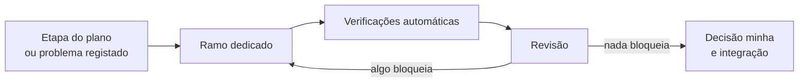

# Como fiz este projeto

Escrevo isto para explicar as decisões, não o código.

## Porquê o Claude Code

Podia ter escrito tudo à mão e entregado as páginas pedidas. Preferi trabalhar com o Claude Code,
um agente que programa a partir de regras escritas no próprio repositório, porque isso muda o sítio
onde gasto o tempo: passo-o a especificar, a rever e a decidir, em vez de o passar a escrever
ficheiros. Foi essa troca que me deu margem para entregar mais do que o enunciado pede.

O enunciado pede uma aplicação em Remix. O Remix v2 chegou ao fim de vida e fundiu-se no React
Router, cujo modo framework é o sucessor direto. A LTP Labs confirmou que qualquer versão serve,
por isso usei o React Router v8.

## O que acrescentei ao enunciado

Duas coisas.

Multilingue, porque no primeiro dia custa quase nada e mais tarde custa caro. Quem deixa isto para
o fim volta a todas as páginas, a todos os preços e a todos os plurais. Pus a segunda língua na
fundação, português de Portugal.

Acessibilidade, porque a Diretiva (UE) 2019/882 já obriga as lojas em linha a funcionar para
pessoas com deficiência. Não é um extra, é a lei. Segui a WCAG 2.2 no nível AA desde o início, que
é a única altura em que sai barata.

## O plano

Antes da primeira linha escrevi um plano: 31 decisões fechadas de uma vez e 14 etapas por ordem,
cada uma com o critério que diz quando está pronta. Fechar as decisões à cabeça evita que o agente
invente uma resposta diferente em cada sessão, e era esse o erro que eu queria evitar. Sempre que a
realidade me obrigou a mudar alguma coisa, registei o porquê.

## As ferramentas que escrevi para o projeto

Ainda antes de construir, escrevi os procedimentos que o agente segue e que acabam sempre numa
decisão minha: abrir um problema, analisá-lo, corrigi-lo num ramo só dele, gravar com a mensagem no
formato imposto, abrir a proposta, lançar a revisão, integrar. A revisão corre com agentes
especializados, um por domínio, e no fim entra um verificador cético que relê o código citado e
tenta deitar abaixo as conclusões graves. Precisava dele, porque um revisor automático assinala
problemas que não existem e eu não queria andar a caçar fantasmas.

## Executar, rever, corrigir

Cada etapa teve o seu ramo e a sua proposta. Em cada uma correm as licenças, os tipos, o estilo, a
formatação, os testes unitários, a compilação e os testes num navegador a sério, em quatro
configurações: computador, telemóvel, navegador sem JavaScript e o site em português. Chumba uma,
não entra.

Fechadas as 14 etapas saiu a versão 1.0.0, e não ficou perfeita. Usei a loja, encontrei defeitos e
corrigi-os pelo mesmo caminho: o botão de menos no carrinho não submetia a quantidade, a imagem
grande do produto rebentava com o ecrã, o rodapé não chegava ao fundo nas páginas curtas.

## O que ainda não fiz

Faltam dois testes de acessibilidade que só uma pessoa consegue fazer: percorrer as páginas com o
VoiceOver e com a simulação de daltonismo do Chrome. Ficaram anotados por fazer.
